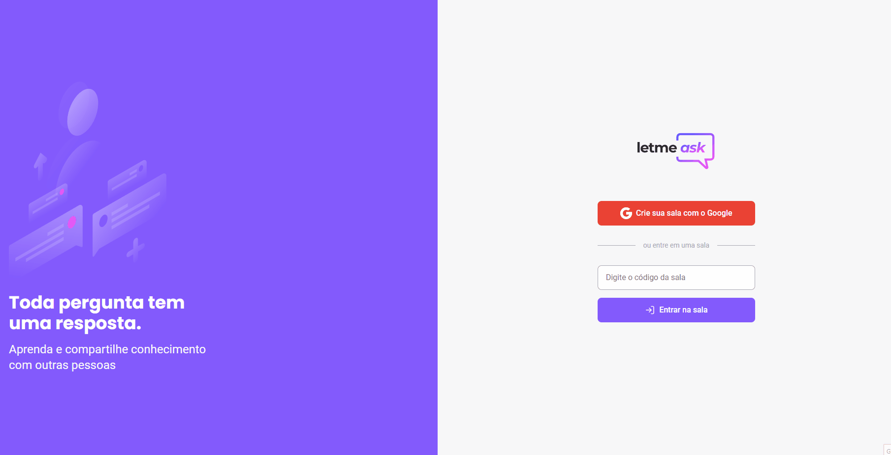

<h1 align="center"></h1>

<h3 align="center">letmeask</h3>

<p align="center">“O que sabemos é uma gota. O que ignoramos é um oceano.”</p>

<p align="center">
  <a href="#about">Sobre</a>&nbsp;&nbsp;&nbsp;|&nbsp;&nbsp;&nbsp;
  <a href="#install">Instalação</a>&nbsp;&nbsp;&nbsp;|&nbsp;&nbsp;&nbsp;
  <a href="#challenge">Desafios</a>&nbsp;&nbsp;&nbsp;|&nbsp;&nbsp;&nbsp;
  <a href="#technologies">Tecnologias</a>
</p>

## :speech_balloon: Sobre <a name="about"></a>

> [Letmeask](https://letmeask-d0b30.web.app/) é perfeito para criadores de conteúdos poderem criar salas de Q&A com o seu público, de uma forma muito organizada e democrática.

<br />
<table>
  <tr>
    <td colspan="1">Web App</td>
  </tr>
  <tr>
    <td></td></td>
  </tr>
</table>

## :warning: Instalação <a name="install"></a>

```bash
# Instalar as dependências necessárias:
$ yarn

# Configurar as variáveis de ambiente:
$ .env.example to .env.local

# Iniciar o projeto:
$ yarn start

# Regras do Firebase:
$ database.rules.json
```

## :triangular_flag_on_post: Desafio <a name="challenge"></a>

> Aprimorar os principais conceitos de React e aprender os passos básicos para utilização do Firebase.

## :heavy_check_mark: Tecnologias <a name="technologies"></a>

- [React](https://pt-br.reactjs.org/)
- [Firebase](https://firebase.google.com/)
- [TypeScript](https://www.typescriptlang.org/)

---

by [Douglas Scaini](https://www.github.com/douglasscaini) ❤️
